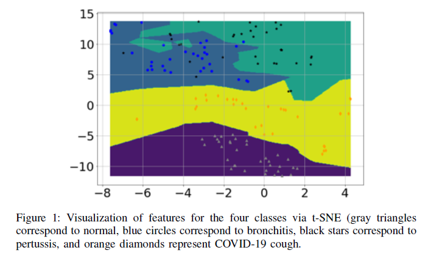
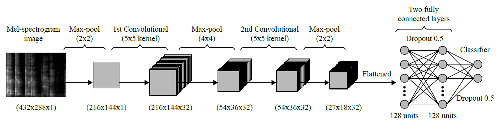
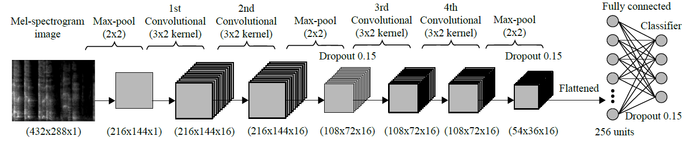
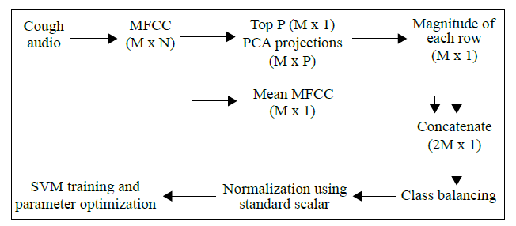

# Pre-screening diagnosis for COVID-19
 
# Abstract: 
COVID-19, an infectious disease caused by the SARS-CoV-2 virus, was declared a pandemic by the World Health Organisation (WHO) in March 2020. Infections have been growing exponentially and tremendous efforts are being made to fight the disease. Many countries like China, U.S. are already using robots, drones and other technological based solution to screen subjects to take early preventive measure to control spread of the pandemic. While developing countries like India are facing scarcity of these testing tools thus slowing down the most important step of controlling the pandemic. Governments of these countries are looking for various cost-effective, large-scale screening methods to channel clinical testing to place where it is most needed. To tackle this problem, we propose a smartphone-based app to do preliminary screening of subjects. Anyone can use this app to record 2 secs of their cough to do self-diagnosis of COVID-19 disease. Centralized server can process audio cough data to recognize it is COVID/non-COVID cough and return user if he/she is likely to have been suffering from COVID disease. This can help user to take proactive actions to control the disease. This can be augmented with location data to help government to recognise potential hotspot region much before clinical testing. This can also help government to channel their attention to area showing large number of symptoms and thus saving lives of many. The proposed app is not clinically verified, we can not be certain of accuracy of the model but can help people and government to take early preventive actions.
 

# Theory :
The idea of using cough for possible preliminary diagnosis of COVID-19 and its feasibility is motivated by the following key findings:
1) Prior studies have shown that cough from distinct respiratory syndromes have distinct latent features [1]. These distinct features can be extracted by appropriate signal processing and mathematical transformations of the cough sounds. The features can then be used to train a sophisticated AI engine for performing the preliminary diagnosis solely based on a cough. An in-depth analysis of the pathomorphological alternations caused by COVID-19 in the respiratory system shows that the alternations are distinct from those caused by other common non-COVID-19 respiratory diseases. This finding was corroborated by the meta-analysis of several independent recent studies that show that COVID-19 infects the respiratory system in a unique way. Therefore, it is logical to hypothesize that a cough caused by COVID-19 is also likely to have distinct latent features. These distinct latent features can be exploited to train a domain aware AI engine to differentiate COVID-19 caused cough from non-COVID-19 cough.

# A. DATA USED FOR TRAINING COUGH DETECTOR
In order to make this app employable in a public place or where various background noises may exist, we design and include a cough detector in our AI-Engine. This cough detector acts as a filter before the diagnosis engine and is capable to distinguish sound from 50 other common environmental noise. To train and test this detector, we use ESC-50 dataset [2]. The ESC-50 dataset is a publicly available dataset that provides a huge collection of speech and environmental sounds. This collection of sounds is categorized into 50 classes, one of these being cough sounds. We have used 993 cough sounds and 993 non-cough environmental sounds for the training of our cough detection system.

B. DATA USED FOR TRAINING COVID-19 DIAGNOSIS ENGINE:

To train our cough diagnosis system, we will collect cough sounds from COVID-19 patients as well as pertussis and bronchitis(As). We also collected normal coughs, i.e., cough sounds from healthy people. At the time of writing, we had access to 102 bronchitis, 131 pertussis, 48 COVID-19, and 76 normal cough sounds to train and test our diagnosis system. Obviously these are very small numbers of samples and more data is needed to make the solution more reliable. New COVID-19 cough samples are arriving daily and we are using these unseen samples to test the trained algorithm. Even with small training data, very promising accuracy has been observed on unseen test samples, as reported in 

# B. DATA PRE-PROCESSING AND VISUALIZATION TO EVALUATE PRACTICAL FEASIBILITY OF AI4COVID-19
[2] assesses and establishes the theoretical viability of the hypothesis using deep domain knowledge. However, in machine learning-based solutions, theoretical viability does not guarantee practical viability as the end outcome depends on the quantity and quality of the data, in addition to the sophistication of machine learning algorithm used. Therefore, it uses the available cough data from the four classes to first evaluate the practical feasibility of a cough based COVID-19 diagnosis solution. It converts the cough data for all four classes into Mel scale for further processing. The Mel scale is a pitch categorization where listeners judge changes in pitch to be equal in distance from one another along this scale. It is meant to make changes in frequency, such as with a spectrogram, more closely reflect audible changes.

Figure 1 illustrates the 2-D visualization of these features for the four classes through t-distributed Stochastic Neighbor Embedding (t-SNE) with classification decision boundaries/contours. It can be seen from the figure that different cough types possess features distinct from each other, and the features for COVID-19 are different from other cough types, such as bronchitis and pertussis. Hence, this observation validates the practical viability of AI4COVID19 based diagnosis encouraging us to proceed towards AI engine design for maximum accuracy and efficient implementation. 

The smartphone app records sound/cough when prompted with the press and release button. The recorded sounds are transmitted to the server when the diagnosis button is pressed. At the server, the sounds are first fed into the cough  detector. In case, the sound is not detected to be cough, the server commands the app to prompt so. In case, the sound is detected to be a cough, the sound is forwarded to the three parallel, independent classifier systems: Deep Learning-based Multi Class classifier (DL-MC), Classical Machine Learning-based Multi Class classifier (CML-MC), Deep Learning-based Binary Class classifier (DL-BC). The results of the all three classifiers are then passed on to a mediator. The app reports a diagnosis only if all three independent classifiers return identical classification results. If the classifiers do not agree, the app returns ‘test inconclusive’. This tri-pronged mediator centered novel architecture is designed to effectively minimize the probability of misdiagnosis.

# C. SYSTEM ARCHITECTURE 
The overall system architecture is illustrated in Figure 2. The smartphone app records sound/cough when prompted with the press and release button. The recorded sounds are transmitted to the server when the diagnosis button is pressed. At the server, the sounds are first fed into the cough detector. In case, the sound is not detected to be cough, the server commands the app to prompt so. In case, the sound is detected to be a cough, the sound is forwarded to the three parallel, independent classifier systems: Deep Learning-based Multi Class classifier (DL-MC), Classical Machine Learning-based Multi Class classifier (CML-MC), Deep Learning-based Binary Class classifier (DL-BC). The results of the all three classifiers are then passed on to a mediator. The app reports a diagnosis only if all three independent classifiers return identical classification results. If the classifiers do not agree, the app returns ‘test inconclusive’. This tri-pronged mediator centered novel architecture is designed to effectively minimize the probability of misdiagnosis. With this architecture, results show that AI4COVID-19 engine predicting ‘COVID-19 likely’ when the subject is not suffering from COVID-19 or vice-versa is extremely low, almost zero on the testing data available at the time of writing. This idea is inspired from the "second opinion" practice in health care. The added caution here is that three independent opinions (diagnosis) are solicited, each with veto power. How this novel architecture manages to reduce the overall misdiagnosis rate of the AI4COVID-19 despite the relatively higher misdiagnoses rate of individual classifiers.

# D. COUGH DETECTION 
The recorded cough sample is forwarded to our network server where the cough detector engine first computes its Mel-spectrogram (as explained in Section III-C), converts it into grayscale to unify the intensity scaling and reduce the image dimensions, and feed it into the Convolutional Neural Network (CNN) to decide whether the recorded sound is of cough or not. An overview of our used CNN structure is shown in Figure 3. As the input Mel spectrogram image is of high dimensions, it’s first passed through a 2 × 2 max-pooling layer to reduce the overall model complexity before proceeding. This relatively smaller image is then passed to two convolutional layers consisting of 32 filters and 5 × 5 kernel size with a max-pooling layer in between to learn the complex features, which are then passed to a 2 × 2 max-pooling to represent the learned features in lower dimensions. The image is flattened to 1 dimension and then passed to two fully connected layers with 128 neurons each. 0.5 dropout is used in both of these to avoid overfitting. The final layer is the softmax classification layer with 2 neurons to distinguish between cough and not cough for the given input. The number of convolutional and fully connected layers are kept low to minimize potential overfitting issues. Since ReLU is the current standard for CNNs, it is used for the activation functions of this model, while Adam is used as the optimizer due to its relatively better efficiency and flexibility. A binary cross entropy loss function completes the detection model.

 

# Deep Learning-based Multi Class classifier (DL-MC)
The first solution leverages a CNN based four class classifiers using Mel spectrograms (described above) as input. The four classes here are cough caused by: 1) COVID-19, 2) pertussis, 3) bronchitis, or 4) normal person with no known infection. The same type of machine learning categorization procedure used for binary-class cough detection is applied to the labeled cough data originating from several different illnesses. However, due to the differences between two coughs of differing illnesses typically being subtler than a cough and
non-cough event, a more complex set of layering is required for this version of the CNN. 

# Classical Machine Learning-based Multi Class classifier
(CML-MC) A second parallel diagnosis test uses classic machine learning instead of deep learning. It begins with a different preprocessing of cough sounds. Instead of using spectrogram like the first classifier, it uses MFCC and PCA based feature extraction as explained in Section III-C. These smart features are then fed into a multi-class support vector machine for classification. Class balance is achieved by sampling from each class randomly such that the number of samples equals to the number of minority class samples, i.e., class with the lowest number of samples. Using the concatenated feature matrix (of mean MFCC and top few PCAs) as input, we perform SVM with k-fold validation for 100,000 iterations. This approach is illustrated in Figure below.
 
 

#  Deep Learning-based Binary Class classifier (DL-BC)
The third parallel diagnosis test also uses deep learning based CNN on the Mel spectrogram image of the input cough samples, similar to the first branch of the AI engine, but performs only binary classification of the same input, i.e., is the cough associated COVID-19 or not. The CNN structure used for this technique is the same as the one used for cough detector, elaborated in Figure below.

# Mediator
To make the results as reliable as possible with the limited data available at the moment, we propose and implement a novel architecture for the AI engine. It consists of three parallel classification solutions designed independently by three teams. The classifiers outcomes are cross-validated by an automated mediator. Each classifier has a veto power, i.e., if all three classifiers do not agree, the app returns ‘Test inconclusive’. This novel architecture thus minimizes chances of misdiagnosis, compared to stand alone classifiers
with binary diagnosis. 

# HeatMap
The idea behind providing a heatmap is helpful from a lot of region wide preparations point of view from the and monitoring hotspots. The User can also be prompted to retest after a defined SLA (say 2-3 days) to keep updated track with the help of notifications to track the spread. The region can further be classified as Green, Orange, Red zones depending on the spread.

# Scope

# References :
[1] C. Bales, C. John, H. Farooq, U. Masood, M. Nabeel, and A. Imran, “Can Machine Learning Be Used to Recognize and Diagnose Coughs?” arXiv preprint arXiv:2004.01495, 2020.

[2] Ali Imran, Iryna Posokhova, Haneya N. Qureshi, Usama Masood, Sajid Riaz, Kamran Ali, Charles N. John, Muhammad Nabeel, “AI4COVID-19: AI Enabled Preliminary Diagnosis for COVID-19 from Cough Samples via an App”, arXiv preprint arXiv:2004.01275, 2020.

